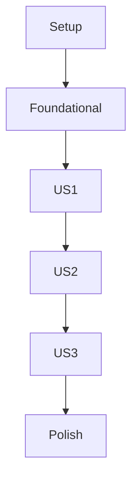

# Tasks: Interactive RAG Chatbot Integration

## Phase 1: Setup (Project Initialization)

- [X] T001 Create backend project structure: `backend/src/models/`, `backend/src/services/`, `backend/src/api/`, `backend/tests/`
- [X] T002 Create frontend project structure within Docusaurus: `frontend/src/components/`, `frontend/src/pages/`, `frontend/src/services/`, `frontend/tests/`
- [X] T003 Configure Python environment and install FastAPI, Uvicorn, httpx, qdrant-client, google-cloud-functions dependencies in `backend/`
- [X] T004 Configure Node.js environment and install Docusaurus, React, Jest, React Testing Library (RTL) dependencies in `frontend/`
- [X] T005 Initialize `pytest` for backend testing in `backend/`
- [X] T006 Initialize `Jest` and `React Testing Library (RTL)` for frontend testing in `frontend/`

## Phase 2: Foundational (Blocking Prerequisites for all User Stories)

- [ ] T007 Implement basic user authentication integration with Better Auth in `backend/src/services/auth_service.py`
- [ ] T008 [P] Define `Textbook Content` data model in `backend/src/models/textbook_content.py`
- [ ] T009 [P] Define `Text Chunk` data model in `backend/src/models/text_chunk.py`
- [ ] T010 [P] Define `User` data model in `backend/src/models/user.py`
- [ ] T011 [P] Define `User Query` data model in `backend/src/models/user_query.py`
- [ ] T012 [P] Define `Chatbot Response` data model in `backend/src/models/chatbot_response.py`
- [ ] T013 [P] Define `Chat Session` data model and state transitions in `backend/src/models/chat_session.py`
- [ ] T014 Implement Qdrant Cloud client and connection in `backend/src/services/qdrant_service.py`
- [ ] T015 Implement Gemini API client and connection for embeddings and LLM in `backend/src/services/gemini_service.py`
- [ ] T016 Implement documentation parsing service (Markdown, PDF) in `backend/src/services/document_parser.py`
- [ ] T017 Implement documentation ingestion service logic in `backend/src/services/ingestion_service.py`
- [ ] T018 Implement re-indexing mechanism (manual trigger) in `backend/src/services/indexing_service.py`
- [ ] T019 Implement re-indexing mechanism (periodic schedule) in `backend/src/services/indexing_scheduler.py`
- [ ] T020 [P] Implement Admin API endpoint `POST /admin/ingest` in `backend/src/api/admin.py`
- [ ] T021 [P] Implement Admin API endpoint `GET /admin/sources` in `backend/src/api/admin.py`
- [ ] T022 [P] Implement Admin API endpoint `POST /admin/sources` in `backend/src/api/admin.py`
- [ ] T023 [P] Implement Admin API endpoint `PUT /admin/sources/{source_id}` in `backend/src/api/admin.py`
- [ ] T024 [P] Implement Admin API endpoint `DELETE /admin/sources/{source_id}` in `backend/src/api/admin.py`
- [ ] T025 [P] Implement Admin API endpoint `POST /admin/reindex` in `backend/src/api/admin.py`
- [ ] T026 [P] Implement Admin API endpoint `GET /admin/logs` in `backend/src/api/admin.py`
- [ ] T027 [P] Implement Admin API endpoint `POST /admin/rag/config` in `backend/src/api/admin.py`

## Phase 3: User Story 1 - Ask Textbook-Related Question (Priority: P1)

- [ ] T028 [US1] Implement RAG core logic for retrieval and LLM generation in `backend/src/services/rag_service.py`
- [ ] T029 [US1] Implement Chat API endpoint `POST /chat/query` in `backend/src/api/chat.py`
- [ ] T030 [US1] Develop basic chat input component in `frontend/src/components/ChatInput.js`
- [ ] T031 [US1] Develop basic chat display component in `frontend/src/components/ChatDisplay.js`
- [ ] T032 [US1] Integrate `ChatInput` and `ChatDisplay` into a Docusaurus page/component in `frontend/src/pages/ChatbotPage.js` (or similar)
- [ ] T033 [US1] Connect frontend chat interface to `POST /chat/query` endpoint in `frontend/src/services/chat_api.js`
- [ ] T034 [US1] Implement handling for polite responses to out-of-scope questions in `backend/src/services/rag_service.py`

## Phase 4: User Story 2 - Get Contextual Information (Priority: P2)

- [ ] T035 [US2] Implement Chat API endpoint `GET /chat/sources/{response_id}` in `backend/src/api/chat.py`
- [ ] T036 [US2] Develop component for displaying source document references in `frontend/src/components/SourceDisplay.js`
- [ ] T037 [US2] Integrate `SourceDisplay` into `ChatDisplay` to show citations/links for chatbot responses in `frontend/src/components/ChatDisplay.js`
- [ ] T038 [US2] Ensure chatbot responses from `rag_service.py` include `retrieved_chunks_refs` for source linking.

## Phase 5: User Story 3 - Seamless Interaction (Priority: P2)

- [ ] T039 [US3] Implement Chat API endpoint `GET /chat/history` in `backend/src/api/chat.py`
- [ ] T040 [US3] Develop chat history retrieval and display in `frontend/src/services/chat_api.js` and `frontend/src/components/ChatDisplay.js`
- [ ] T041 [US3] Implement Chat API endpoint `POST /chat/feedback` in `backend/src/api/chat.py`
- [ ] T042 [US3] Develop feedback submission mechanism in `frontend/src/components/ChatDisplay.js`
- [ ] T043 [US3] Implement typing/processing indicators in `frontend/src/components/ChatDisplay.js`
- [ ] T044 [US3] Implement client-side optimizations for response latency (e.g., loading states) in `frontend/src/services/chat_api.js`

## Final Phase: Polish & Cross-Cutting Concerns

- [ ] T045 Implement comprehensive logging for the RAG service (backend) in `backend/src/utils/logger.py`
- [ ] T046 Configure monitoring and alerting for RAG service health and performance (e.g., Google Cloud Monitoring) in `backend/deploy/monitoring.yaml` (or similar)
- [ ] T047 Enhance error handling with robust silent retry mechanisms for external API calls (Gemini, Qdrant) in `backend/src/services/error_handler.py`
- [ ] T048 Implement security hardening for Admin API endpoints (e.g., stricter access control, input validation) in `backend/src/api/admin.py`
- [ ] T049 Develop deployment scripts for Python backend to Google Cloud Functions in `backend/deploy/gcloud_deploy.sh`
- [ ] T050 Conduct end-to-end integration testing for all user stories and admin functionalities in `backend/tests/integration/`, `frontend/tests/integration/`
- [ ] T051 Optimize Docusaurus frontend for responsiveness and accessibility in `frontend/src/css/custom.css` and other relevant frontend files.

## Dependency Graph (User Story Completion Order)

## Parallel Execution Examples (within phases where applicable)

- **Phase 2 (Foundational)**:
    - [T008] Define `Textbook Content` data model
    - [T009] Define `Text Chunk` data model
    - [T010] Define `User` data model
    - [T011] Define `User Query` data model
    - [T012] Define `Chatbot Response` data model
    - [T013] Define `Chat Session` data model
    - [T020] Implement Admin API `POST /admin/ingest`
    - [T021] Implement Admin API `GET /admin/sources`
    - [T022] Implement Admin API `POST /admin/sources`
    - [T023] Implement Admin API `PUT /admin/sources/{source_id}`
    - [T024] Implement Admin API `DELETE /admin/sources/{source_id}`
    - [T025] Implement Admin API `POST /admin/reindex`
    - [T026] Implement Admin API `GET /admin/logs`
    - [T027] Implement Admin API `POST /admin/rag/config`

## Implementation Strategy

The implementation will follow an MVP-first approach, iteratively delivering each user story.

### Suggested MVP Scope (User Story 1)

Focus on delivering User Story 1 "Ask Textbook-Related Question" as the initial MVP. This includes:
- All tasks in Phase 1 (Setup).
- All tasks in Phase 2 (Foundational).
- All tasks in Phase 3 (User Story 1).
- Minimal essential tasks from the Final Phase (e.g., basic logging, deployment for MVP).

This provides a functional chatbot for core Q&A, allowing for early user feedback and validation.

## Format Validation

All tasks strictly follow the checklist format (`- [ ] [TaskID] [P?] [Story?] Description with file path`).